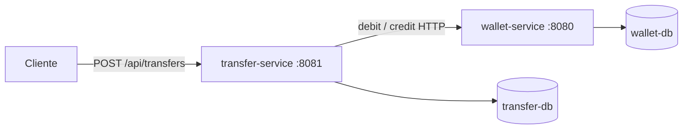
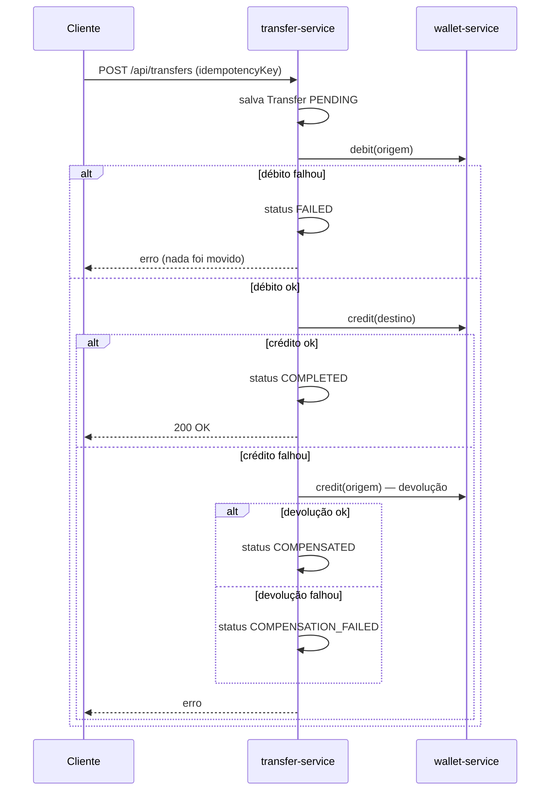

# transfer-service

Microsserviço de transferências entre carteiras digitais. Ele **não guarda saldo**: quem guarda é o
wallet-service (repositório separado: `https://github.com/SEU-USUARIO/wallet-service`, troque pelo link real).
O transfer-service orquestra a operação chamando a API do wallet-service via HTTP (débito na origem,
crédito no destino) e registra o resultado no próprio banco.

O foco do projeto é mostrar comunicação real entre microsserviços e como lidar com falhas parciais
sem transação distribuída (padrão **Saga com compensação**).

## Stack

- Java 21, Spring Boot 4, Spring Data JPA, Bean Validation
- `RestClient` com timeouts (conexão 2s, leitura 5s) para chamar o wallet-service
- PostgreSQL (um banco por serviço)
- Docker e Docker Compose
- JUnit 5 + Mockito + AssertJ

## Arquitetura



## Fluxo de uma transferência



## Status da transferência

| Status | Significado |
|---|---|
| `PENDING` | criada, ainda processando |
| `COMPLETED` | débito e crédito concluídos |
| `FAILED` | não conseguiu debitar; nada foi movido |
| `COMPENSATED` | debitou, o crédito falhou e o dinheiro foi devolvido |
| `COMPENSATION_FAILED` | debitou, o crédito falhou e a devolução também: precisa de intervenção manual |

## Endpoint

### `POST /api/transfers`

```json
{
  "fromUserId": "uuid-da-origem",
  "toUserId": "uuid-do-destino",
  "amount": 50.00,
  "idempotencyKey": "chave-unica-da-operacao"
}
```

| HTTP | Quando |
|---|---|
| 200 | transferência concluída (`COMPLETED`) |
| 400 | dados inválidos ou origem igual ao destino |
| 404 | carteira não encontrada |
| 409 | `idempotencyKey` já processada |
| 422 | saldo insuficiente |
| 503 | wallet-service indisponível |

## Como rodar

Pré-requisitos: Docker e Docker Compose, e o código do wallet-service na sua máquina.

O `docker-compose.yaml` constrói o wallet-service a partir da pasta indicada em `build.context` do
serviço `wallet-service`. Ajuste esse caminho para onde o wallet-service está no seu computador
(a pasta que contém o `pom.xml` e o `Dockerfile` dele).

```bash
docker compose up --build
```

- transfer-service: http://localhost:8081
- wallet-service: http://localhost:8080
- Postgres do transfer-service exposto em `localhost:5433` (usado pelos testes)

Para subir em segundo plano: `docker compose up -d --build`.
Para parar: `docker compose down` (use `down -v` para apagar também os dados dos bancos).

## Testando manualmente

### PowerShell (Windows)

```powershell
function Chamar($metodo, $url, $corpo) { try { Invoke-RestMethod -Method $metodo -Uri $url -ContentType "application/json" -Body ($corpo | ConvertTo-Json) } catch { Write-Host "ERRO HTTP $($_.Exception.Response.StatusCode.value__): $($_.ErrorDetails.Message)" -ForegroundColor Yellow } }

$a = [guid]::NewGuid(); $b = [guid]::NewGuid()

# criar as duas carteiras e dar saldo à A
Chamar Post http://localhost:8080/api/wallets @{ userId = $a }
Chamar Post http://localhost:8080/api/wallets @{ userId = $b }
Chamar Post "http://localhost:8080/api/wallets/$a/credit" @{ amount = 100 }

# transferir 50 de A para B
Chamar Post http://localhost:8081/api/transfers @{ fromUserId = $a; toUserId = $b; amount = 50; idempotencyKey = "teste-1" }
```

### bash / Git Bash

```bash
curl -X POST http://localhost:8080/api/wallets \
  -H "Content-Type: application/json" -d '{"userId": "<USER_A>"}'

curl -X POST http://localhost:8080/api/wallets \
  -H "Content-Type: application/json" -d '{"userId": "<USER_B>"}'

curl -X POST http://localhost:8080/api/wallets/<USER_A>/credit \
  -H "Content-Type: application/json" -d '{"amount": 100.00}'

curl -X POST http://localhost:8081/api/transfers \
  -H "Content-Type: application/json" \
  -d '{"fromUserId":"<USER_A>","toUserId":"<USER_B>","amount":50.00,"idempotencyKey":"teste-1"}'
```

### Cenários e resultados esperados

| Cenário | Como provocar | Resultado |
|---|---|---|
| Sucesso | transferência válida | 200, `COMPLETED`, saldos 50 e 50 |
| Chave repetida | reenviar `teste-1` | 409 |
| Saldo insuficiente | valor maior que o saldo, chave nova | 422, transferência `FAILED` |
| Compensação | `toUserId` inexistente | 404, transferência `COMPENSATED`, saldo da origem intacto |
| Wallet fora do ar | `docker compose stop wallet-service` | 503, transferência `FAILED` |

Para conferir o que foi gravado:

```powershell
docker compose exec transfer-db psql -U transfer -d transfer -c "select status, amount, idempotency_key from transfers;"
docker compose exec wallet-db psql -U wallet -d wallet -c "select balance, user_id from wallets;"
```

Depois do teste do wallet fora do ar, religue com `docker compose start wallet-service`.

## Testes automatizados

O Postgres do transfer-service precisa estar rodando, porque o teste de contexto do Spring
(`TransferServiceApplicationTests`) conecta em `localhost:5433`:

```bash
docker compose up -d transfer-db
./mvnw test
```

Os testes do `TransferService` (Mockito, sem banco e sem rede) cobrem: sucesso, origem igual ao
destino, chave duplicada, corrida na constraint única, falha no débito, compensação bem-sucedida e
compensação que também falha.

## Decisões de projeto

- **Sem `@Transactional` no fluxo**: não faz sentido segurar uma transação de banco aberta durante chamadas HTTP. Cada mudança de status é salva separadamente.
- **Idempotência**: `idempotencyKey` com constraint única no banco. Além do `findBy` inicial, a constraint protege contra duas requisições simultâneas com a mesma chave.
- **Compensação em vez de transação distribuída**: se o crédito falha, o serviço devolve o valor à origem e registra o resultado.
- **Timeouts explícitos** no cliente HTTP, para uma chamada lenta não travar o serviço.
- **Tradução de erros pelo código HTTP**: o `WalletClient` decide o tipo de erro pelo número do status (404, 422), sem depender de subclasses de exceção do Spring que mudam entre versões.
- **Tratamento de erros centralizado** em `GlobalExceptionHandler`, traduzindo exceções de domínio em status HTTP.

## Limitações conhecidas

- **Timeout no débito é ambíguo**: o wallet-service pode ter debitado mesmo assim, e a transferência fica `FAILED`. A solução completa é o wallet-service aceitar uma chave de idempotência por operação.
- **Queda entre débito e crédito** deixa a transferência `PENDING`. Um job de reconciliação resolveria isso.
- **`COMPENSATION_FAILED`** hoje só vira exceção e registro no banco. Em produção iria para fila de retry e alerta.
- **Contrato implícito entre os serviços**: o transfer-service assume que o wallet-service responde 404 (carteira inexistente) e 422 (saldo insuficiente). Não há contrato formal nem teste automatizado entre os dois.
- Repetir a mesma `idempotencyKey` devolve 409. Outra abordagem comum é devolver o resultado da transferência original.